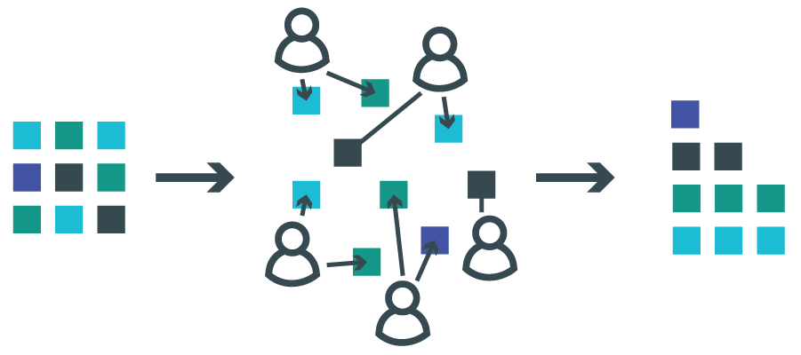
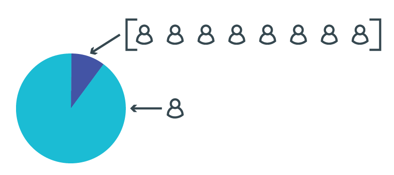
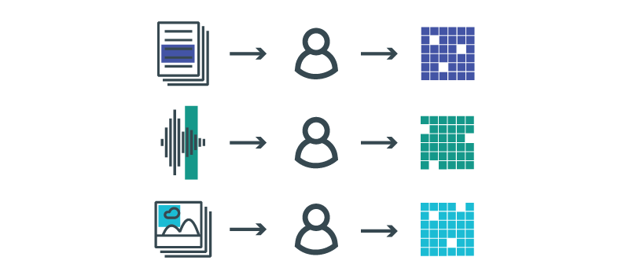
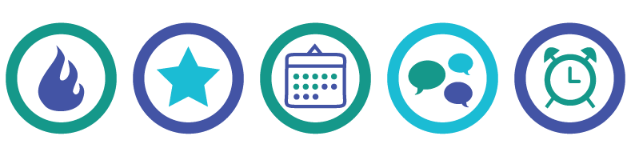

# Microtasking

## Definition

Microtasking is the process of splitting a large job into small tasks that can be distributed, over the Internet, to many people. Machines and algorithms are very efficient at certain functions, such as identifying patterns in an image or performing advanced calculations, but other tasks, including identifying the contents of an image or recognizing obscure text, are still best performed by humans.

Microtasking platforms provide a way for anyone sitting at their computer to contribute to important tasks - they can get involved in noticing changes in forestry, or in noticing blemishes on an image that might indicate attacks on a certain area. For an organisation, microtasking brings benefits like distributing the workload, but it also requires a lot of thought and strategic planning.  The content of this site is based on a series of interviews with people who have worked on microtasking platforms, and outlines the work that goes into running a successful microtasking platform.

---

## Examples

This process has been used for over ten years in the commercial sector. Microtasking workplaces like [Mechanical Turk](//www.mturk.com) or [ClickWorker](//www.clickworker.com/) connect businesses with people around the world to outsource small tasks for pay. Example tasks include tagging photos from social media, typing out business card information from a photo, and digitising receipts and invoices.

Increasingly, this technology is being used by the not for profit sector. The following initiatives have successfully applied microtasking for humanitarian or social purposes, and their staff were interviewed for the creation of this report. They represent projects with a wide range of sophistication and volunteer engagement, from tens to tens of thousands. Some were large organizations with dedicated communications teams, while others recruited a volunteer developer to build their platform.

- [Planetary Response Network](//irevolution.net/2014/06/03/zoomanitarians/). Tagging satellite/aerial imagery to accelerate disaster damage assessments, using Zooniverse.
- [GeoTag-X](//geotagx.org/). Extracting data from images of disasters, using Pybossa.
- [Greenpeace Guardianes](//greenpeace.org.ar/guardianes/index-EN.php ). Identifying deforestation/forest degradation from Landsat satellite imagery. Previously used Silverlight, currently building a new version.
- [Global Forest Watch Fires](//fires.globalforestwatch.org). Identifying fires and haze from satellite imagery, using Tomnod.
- [Fairplay Alliance](//www.fair-play.sk/). Pulling out data from contracts, using a system built independently.
- [Vozdata](//blogs.lanacion.com.ar/projects/data/vozdata/). Transcribing information on expenses from PDFs, using Crowdata.
- [Micromappers](http://micromappers.org/). Combining the extraction of data from images and social media with machine learning, using Pybossa.

---

## Tools and Platforms

Several existing tools allow organizations to create and launch their own microtasking project. The table below compares key functional differences between the platforms used by the example initiatives above.

Platform | [Tomnod](//www.tomnod.com) | [Zooniverse](//www.zooniverse.org) | [Checkdesk](//checkdesk.org) | [Crowdcrafting + Pybossa](//crowdcrafting.org) | [Pybossa](//pybossa.com) | [Crowdata](//crowdata.github.com) | [Micromappers](//github.com/micromappers) |
-------- | -------- | -------- | -------- | -------- | -------- | -------- |
__Location__ | Colorado, USA | Chicago, USA and Oxford, England | San Francisco, USA | Unknown | Madrid, Spain | Buenos Aires, Argentina | Doha, Qatar |
__Created__ | 2011 | 2009 | 2011 | 2011 | 2011 | 2013 | 2013
__Allowed Data Formats__ | Visual | Visual, Audio | Visual and Text | Visual, Text, Audio | Visual, Text, Audio | Text | Visual, Text, Audio |
__Allowed Microtasks__ | Discovery | Discovery, Verification | Verification | Discovery, Verification | Varies | Verification, Data Release | Discovery, Verification |
__Allows Custom Data Fields__ | Yes | Yes | No | Yes | Yes | Yes | Yes |
__Allows Anonymous Users__ | Yes | Yes | No | Yes | Yes | No | Yes |
__Allows Private Projects__ | Yes | Yes | Yes | No | Yes | Yes | Forthcoming |
__Allows Gamification__ | Yes | No | No | Yes | Yes | Yes | No |
__Data Hosting__ | Amazon Web Services | Zooniverse Server | Project's own server | Crowdcrafting Server | Project's own server | Project's own server | Project's own server |
__Languages__ | English | English, German, Polish | English, Arabic | English, Spanish | English, Spanish, Italian, French, German, Greek, Japanese | English, Spanish | English (links with Translators without Borders |
__Mobile Compatible__ | No | Yes | No | No | Yes | Yes | Yes |
__License__ | Property of Digital Globe | Apache 2 License | GNU General Public License | GNU Affero General Public License | GNU Affero General Public License | MIT License | GNU Affero General Public License |

---

## Pros and Cons

### Advantages

Microtasking has two principal benefits.

* __Getting data that would otherwise be time-consuming to process or impossible to access.__ Any problem that can be broken into small tasks can potentially be crowdsourced to volunteers. Popular microtasking mechanisms include answering questions, transcribing information, identifying points, drawing shapes, and comparing two pieces of data.

| **Data types**         | **Volunteer engagement**                   |
|--------------------|----------------------------------------|
| Documents          | Transcribing, verifying                |
| Satellite imagery  | Identifying features                   |
| Video              | Counting, describing                   |
| Photography        | Comparing, identifying                 |
| Social media posts | Classifying, prioritising              |
| SMS                | Transcribing, translating, classifying |
| Maps               | Digitising, contributing               |

* __Engaging volunteers actively in an issue.__ A major challenge for many member-driven organizations is turning web-based support into real world action. Beyond sharing information or providing financial support (often derided as “clicktivism”), microtasking offers volunteers the opportunity to be actively involved, learn more about an issue, and make a meaningful contribution.

### Disadvantages

Microtasking won’t be an effective solution for some organizations or projects.

* __Stretching resource-constrained organizations.__ Significant staff time may be required to engage volunteers, monitor the quality of their work, and keep them motivated. Resource-constrained organizations may not be able to undertake microtasking easily.
* __Skewing results for nefarious or benign reasons.__ Microtasking creates the potential that a small number of contributors could skew the data produced by the platform. This could be for political and commercial reasons, or because users were not using the platform in that way that was intended.
* __Dividing opinions on data reliability.__ Because microtasking is a radical departure from existing research methods, it will draw doubt. Some will question the quality of data submitted by volunteers. Others may view it as an unnecessary disruption to existing workflows from untrusted individuals.

#### Responsible Data Issues

Interviewees also noted the following more general risks.

* Microtasking contributions are inherently unpredictable – both in terms of quantity and quality. Setting up an advocacy campaign dependent on microtasking data before having the data to back up the claims involves a leap of faith.
* Allowing the public to contribute their own content necessarily involves giving up some control over what is communicated on the platform.
* Volunteers contributing to humanitarian response may be exposed to sensitive and sometimes highly graphic content, so the opening of this information to the broader public poses ethical challenges. Organizations must take serious steps to ensure that no harm comes to those who choose to engage in their work.
* Even well-intended volunteers may also accidentally use the platform in a way that was not intended.

---

## Planning

Our interviewees represented projects and platforms that varied widely in terms of size, subject matter and levels of volunteer engagement. For some, planning and launching a microtasking project was a multi-year process involving many incremental improvements and iterations, while others built and launched their project in relatively short time.

### Managing Expectations

Microtasking isn't magic. Recognizing its limitations early in the planning process can allow an initiative to use it as effectively as possible.

* __Most volunteers will contribute for a maximum of 5-10 minutes per week, with a minority contributing more than that.__ However, this minority typically contributes most of the data that microtasking platforms receive. For example, Greenpeace Guardianes said that about 10% of its 30,000 users make 90% of the total contributions to the site.

* __Volunteers are most likely to complete tasks that are comprehensible in a short space of time.__ Interviewees said that projects often struggled with simplifying tasks down into the base unit of analysis. As the founder of Pybossa put it: “‘simple’ doesn’t mean ‘not complex,’ but volunteers shouldn’t need to spend a lot of time trying to understand the task.”
* __‘Divide and conquer’: volunteers should only be asked to complete one type of task at a time.__ Zooniverse’s co-founder noted: “research teams tend to want to milk everything possible out of a task sequence, but experience has demonstrated that it’s always possible to go back and ask questions later on.” Pybossa’s founder added that some organisations were now successfully running 3-5 projects in parallel, with sets of volunteers each conducting a discrete, separate task to collect data that contributed to the project’s overall goal.
* __Volunteers are likely to contribute more effectively when they can access information about the context of a task.__ Tomnod started by giving volunteers access to a small, 400-pixel satellite image, but found that they contributed much more effectively when they could see the wider region of which that image was a part (using satellite imagery from Digital Globe, which runs Tomnod). As the project lead of the Planetary Response Network said: “any project will have complete beginners and near-experts. The idea is to train people so they can become experts [by providing the right guidance].”
* __There is a natural limit to the length of time that most volunteers will contribute.__ As Fairplay Alliance found: “Most of the volunteers were really active for 4-6 weeks – we could sustain it a bit longer with gamification (encouraging competition between users), but not much longer.”
* __Acceptable data formats.__ Microtasking can work well when applied to the division and distribution tasks related to imagery (such as maps or photos), audio, or text.

### Requirements

These are the most commonly cited responsibilities for a successful microtasking team, with the most frequently mentioned at the top. Note that some of these roles may be shared by more than one individual.

* Someone responsible for __attracting new volunteers__ and building momentum around a campaign.
* Someone responsible for __retaining and coordinating volunteers__, including answering queries with basic information about how the platform worked.
* Someone who __understands the subject matter__ and the end use to which the data will be applied. This person should be able to communicate with non-expert users.
* Someone with __web development skills__, with specifics varying depending on the project. For example, working with Micromappers' machine learning capabilities requires someone who has experience with Java.
* Someone with __skills in accessing and processing data__ in the relevant formats for that project – both for designing the platform and monitoring the inputs. For example, several projects using satellite imagery noted that having someone who understands remote sensing and the tasks required to process satellite data was useful.
* Someone with __statistical analysis skills__ for projects that involve dealing with large quantities of data.
* Someone who __understands user experience (UX) design__ to optimize the workflow for maintained and effective engagement.

### Minimizing Risk

Projects collect limited data about their users’ profile and identity. Most platforms or projects allow users to contribute in three ways.

* __Anonymously.__ Many sites collect no personal data about the volunteer user.
* __As a registered user.__ If any information is collected, it is typically an email address. The next most collected piece of information is the user’s name. When collected, names are often optional, likely to prevent users from being discouraged by having to answer too many invasive questions.
* __By IP address.__ Some sites (such as Zooniverse) track users’ IP addresses and their interaction with the platform, but do not collect detailed profile information.

### Maximizing Data Integrity

Interviewees revealed two strategies to improve the integrity of microtasked data.

#### Training Volunteers

Every project recognized the need to get volunteers up to speed on the task, and reported different approaches to doing so.

* Most organisations agreed that instructions on using a platform worked best when they were integrated into the task itself. Several interviewees who had developed platforms had modified their user interface so that users were given a task immediately after starting to use the tool, combined with instructions on how to complete it. Depending on the sensitivity of the information, this training task could be presented using synthetic (or test) data, while others used real project data from the outset.
* Several organisations found that tutorials presented as a separate manual were rarely used.
* In-person meetings were successful, but might be impractical for projects that aim to engage large numbers. For example, Fairplay Alliance, working with groups of around 30 volunteers, invited them to a two-hour meeting where they were trained to use the tool and asked to sign a volunteer contract and non-disclosure agreement.

#### Verification by Design

All projects agreed that verifying and validating data was a crucial part of a successful project, whether that be verifying it before making it public, or before using it internally.

* __Build verification into project design.__ These can range from detailed statistical procedures to a consensus model, where a pre-set number of people who need to agree before a report can be accepted.
  * Greenpeace Guardianes requires 30 confirmations for each hexagon (unit of analysis).
  * Pybossa allows for the number of confirmations to be preset within each instance: for example, a classification might not be added to a project’s database until 10 other users have entered the same classification.
  * Micromappers requires each piece of content to be reviewed by a minimum of three people, and considers it validated if 80% of participants agree with the classification.
  * Tomnod uses ‘Crowdrank’: a method in which a volunteer’s reputation increases as they develop a track record of contributions that a majority of other users agree with. The higher their reputation, the greater weight Tomnod gives to their data.
  * CheckDesk (explicitly a platform for verifying social media reports) adopts a highly transparent verification process in which volunteers use a free-text field to describe their reasons for judging a piece of data to be false (in the style of a comment thread).
* __Reduce ambiguity.__ The more structure is given to volunteers, the less cleaning of the data is likely be required. Fairplay discovered through their pilot stage that providing structured fields rather than free text was a better way to collect useful data.
* __Add intermediary checks.__ Anybody can make mistakes, and in some cases the tasks might not be as easy to complete correctly as envisioned. Additional manual verification by staff can counter this, though some interviewees warned that it can create bottlenecks when large amounts of data are involved.
  * After a data point receives the required 30 confirmations, a Greenpeace Guardianes campaigner has the opportunity to review it.
  * Vozdata gives some more trusted users (mainly people from peer NGOs) special permissions to review content submitted by others.

### Tool Selection

Organisations made project planning decisions for reasons related to their own specific organisational needs. These included the following.

* __Minimising time spent on development.__ Global Forest Watch Fires and GeoTag-X chose Tomnod and Pybossa, respectively, because they were looking for platforms that were already developed and had features that met their needs. As GeoTag-X’s manager put it: “We needed something already ready to go because we had no developer at the time.”
* __Project timelines.__ Fairplay Alliance’s project manager said that they put less time into the design of the app in advance; their main focus was getting the platform working quickly and cheaply because they didn't have the time and money to fine-tune it.
* __Need for specialist information.__ Global Forest Watch Fires chose to work with Tomnod partly because it gave them access to high-quality cloud-free satellite imagery (something that they had previously found hard to access) provided by Digital Globe.

For more on tool selection, read about the engine room's own experience [selecting a microtasking platform](//www.theengineroom.org/behind-the-scenes-how-we-helped-kick-start-a-microtasking-site/).

### Special Considerations

Interviewees held differing opinions on whether gamification was useful or appropriate in microtasking.

#### Gamification

When designing an activity that is intended to encourage repeated participation, designers can add elements more typical of game play (keeping score, creating competition, animations and other friendly interactions). This is called “gamification,” and it can encourage further engagement with a product or service.

Arguments for gamification included:

* __Gamification can make the activity more engaging.__ For platforms where the tasks were repetitive, gamification was seen as a way to “make the activity more entertaining”, to quote Greenpeace Guardianes. These organizations did not actually attempt to create real games, but used gaming mechanisms to make the activity more engaging and fun. For one project, Zooniverse made their classification work more engaging by adding elements of play that didn’t interfere with core tasks: when their Galaxy Zoo volunteers identified galaxies that looked like letters, the platform pulled these out and created an ‘alphabet’ that allowed volunteers to write messages to others.
* __Gamification can create opportunities to reward or praise volunteers for their contributions.__ Some projects used information on how volunteers were contributing to give them physical rewards (which included 3D-printed items, shopping coupons, t-shirts, books and exclusive access to comedy gigs). Others focused on public recognition: a member of the Vozdata team said: “sometimes we mention volunteers on twitter if we know their username.” One smaller project was able to mitigate the risk of favouritism by finding a way to praise each of their 120 volunteers for some element of their contribution.
* __Competition can be a motivating factor__ for some projects that aim to find a small number of very effective contributors, like [FoldIt](//fold.it/portal/info/about), an initiative where contributors fold proteins to generate evidence that humans can contribute to predicting their structure more effectively than computers.

Arguments against gamification included:

* __Singling out individuals as ‘successful’ could discourage broader participation.__ projects that collect multiple independent classifications need to motivate as many people to participate as possible. In these cases, interviewees suggested that gamification could dissuade contributors ranked as 'less successful' from taking part. Zooniverse chooses not to build gamification into their project design, finding that people respond better to cooperative challenges than competitive ones. As a developer at Zooniverse said: “it's not about finding the one person, but finding multiple users”.
* __Emphasising the game aspect can mean losing focus on the task itself.__ Recognising that volunteers were involved in the microtasking activity for motivation that centred around the task itself, some didn’t want to detract from that task without being absolutely sure that assigning points would bring added value to the task in hand.
* __Gamification can increase stress among volunteers.__ Interviewees cited [research](//dl.acm.org/citation.cfm?doid=2583008.2583019) on the topic that has found that volunteers can feel pressurised to stay at the top of a leaderboard, or leave immediately upon reaching the top. At the other end of the spectrum, new volunteers reported feeling daunted by the difficulty of reaching the top of a leaderboard.
* __The subject matter of a platform may be inappropriate for competition.__ As one initiative put it: “Our projects often have a crisis focus...and our thought has been: is it fun to reward people for tagging traumatic things?”
* __Changing the incentives for contribution could decrease the validity of the data.__ One gamified initiative reported problems with cheating – they encouraged people to share public denouncements on social media in exchange for points, but found that volunteers were exploiting a loophole that allowed them to gain points without actually posting anything. “Cheating is something you have to deal with if you’re doing gamification,” they said.

---

## Implementation

### Attracting Volunteers

Positioning a project early to attract volunteers will increase the quantity and quality of work that can ultimately be microtasked.

* __Altruistic motivations.__ Interviewees said that most volunteers were mainly motivated by the idea of helping or making an authentic contribution to an organisation’s work. Interestingly, Tomnod said that they had found the quality of data submitted by volunteers was “far superior” to the data from paid contributions (from the digital labour service Mechanical Turk): “People who are engaged are doing it because they want to. We find again and again that they’re much more motivated.”
* __Communicate how the data will be used.__ Almost all projects said that it is essential to make it clear who the end user of the data is, and how they will use the volunteers’ data in their work. “The biggest thing that drives engagement is knowing that there is somebody at the end of the tunnel – and not too far from the end – who really wants that data.”
* __Supporting the volunteer community.__ Interviewees suggested that those end users need to play a prominent, active role in any online community that the project creates. Whether that is newsletters, blogs, social media or online forums. Key elements of this role were making themselves available for questions from volunteers and providing feedback on how the data would be used to help them.
* __Early involvement.__ Volunteer engagement can be particularly important in the early stages of a project. When the community is starting up, Zooniverse noted that some projects had found it helpful to have people on hand “almost 24/7” to answer questions and encourage new users. Several projects highlighted the importance of meeting people where they already were - for example, Fairplay Alliance answered questions about the platform on a private Facebook group because it was the most widely used format in Slovakia.
* __High-profile users.__ Volunteer engagement can increase when joined by a recognisable or senior figure in the field. For example, crowdsourcing verification platform CheckDesk suggested that the involvement of prominent citizen journalists such as Eliot Higgins on specific tasks bolstered volunteers’ sense that they were contributing to a high-quality endeavour.
* __Keeping the platform consistent__: Greenpeace’s Innovation Lab noticed that far fewer people registered for the second version of their Guardianes platform when it re-launched. They suggested that this could be because the Chrome browser (which a large proportion of their users used) no longer supported the Silverlight plugin on which Guardianes was built. Although Guardianes still worked on other browsers, few users were willing to switch to another one in order to continue their microtasking.
* __Social capital.__ A member of the Vozdata team (at the Argentinian paper La Nacion) said that they were able to attract recruits by using their strong national reputation: “[people] feel that if we are saying and asking for this, it has to be for something good.” She also described ways in which she had responded to students who asked her questions on other topics: “I say, go liberate some documents on Vozdata first, and then I will answer one question.”
* __Timing.__ Several projects found that participation was particularly high when media coverage gave greater prominence to a project’s subject matter. Tomnod recorded 8 million visits in the space of two weeks in 2014, as users searched satellite imagery for evidence of the disappeared Malaysian Airlines plane MH370, while – on a smaller scale – Vozdata typically times its campaigns around specific political events. Other examples include:
  * Global Forest Watch Fires bases its campaigns around the fire season in south-east Asia.
  * GeoTag-X and Micromappers organise activities focused on particular humanitarian crises.
  * Vozdata bases its campaigns around specific political events, such as the release of politicians’ expense records.

### Retaining Volunteers

Once a microtasking project has launched, there is a natural limit to the length of time that most volunteers will contribute. The following tactics can extend that volunteer engagement period.

* __Keeping up momentum.__ Several interviewees found that excitement and pressure were key motivators for encouraging people to keep engaging. Some Zooniverse projects recorded significant spikes in activity after sending out a newsletter asking their community to reach 1 million classifications in a week. Another project noticed that when their communications “went into autopilot” and failed to communicate urgency, volunteer participation dropped off. Greenpeace's Innovation Lab found that participation was highest when their communications around the Guardianes platform were well integrated with the organisation’s broader forests campaign plan and communications outputs.
* __Constant contact.__ The team working on Tomnod realised that “you can’t over-communicate” with volunteers. They use multiple channels to reach their audience, including Twitter, Facebook, a discussion forum and their primary tool: email. Micromappers set up a chatroom each time their tool was used, and found that volunteers would often enjoy interacting with each other - even on issues that had nothing to do with microtasking or the disaster in question.
* __In-person contact.__ Fairplay Alliance began publishing lists of most successful volunteers, giving extra praise to those processed most contracts over which time period. They thought carefully about how to praise and recognise the work of each volunteer, as they found out that this was very valued; in effect, being part of a community seemed to really matter to the volunteers. Over time, Fairplay started organising events for them, inviting them to their office, then (for bigger groups of 30-40 people) providing drinks and organising discussions. “These are the real things that really matter to the people; that they’re taking part with the sense of contributing to something bigger, that you show them what you’re able to do with their help.”
* __Linking volunteer effort to results.__ Some organisations, such as Fairplay, focused a lot of energy on launching the results of their platform publicly. Before they did the public launch of their data, they had a big event where all volunteers were invited, with semi-famous people present, as well as a local comic with private show. They awarded the most active volunteers, with gifts and printed diplomas showing how many contracts they processed. Micromappers highlights top contributors in emails to their mailing list.

---

## About
This site was created by The Engine Room and Amnesty International to understand the ins and outs of micro-tasking, to support Amnesty’s Alt Click project. Comments or questions? Contact [post@theengineroom.org](mailto:post@theengineroom.org).

Alt Click is a two-year project funded by the [Swedish Postcode Lottery](//www.postkodlotteriet.se) that aims to inspire a new generation of tech savvy human rights activists to take part in documenting, verifying and collating evidence of human rights abuse. In this context, Amnesty is planning to use micro-tasking to invite people to analyse satellite images, verify video footage and classify large amounts of social media data.

### Contributors

__Milena Marin__ is the Senior Innovations Campaigner at Amnesty International and project manager of Alt Click. Get in touch to know more about Amnesty's efforts to use microtasking [@milena_iul](//twitter.com/milena_iul).

__[The Engine Room](//theengineroom.org)__ is an international organisation that helps activists, organisations, and other social change agents make the most of data and technology to increase their impact.

From the Engine Room team, on this project [Danna Ingleton](https://www.theengineroom.org/our_team/danna-ingleton/), Responsible Data Program Manager, was involved in project conception and set up. [Zara Rahman](https://www.theengineroom.org/our_team/zara-rahman/) managed the project and came up with the idea of topic-specific microsites like the one you see here. [Tom Walker](https://www.theengineroom.org/our_team/tom-walker/) carried out the research, including all interviews and the write up of the bulk of the content. [Maya Richman](https://www.theengineroom.org/our_team/maya-richman/) contributed the tools functionalities table, and [Tin Geber](https://www.theengineroom.org/our_team/tin-geber/) and [Alix Dunn](https://www.theengineroom.org/our_team/alix-dunn/) provided useful feedback and guidance to the design. The site sourcecode is available on [Github](https://github.com/the-engine-room/library/).
